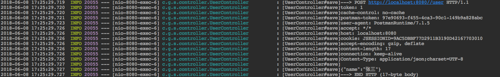
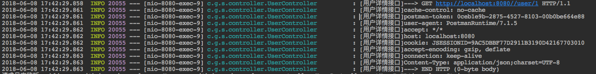

# Spring MVC 日志拦截处理

**使用spirng `HandlerInterceptor`拦截器，基于注解驱动`@SpringMVCLogger`的controler类的方法进行拦截打印日志**

​	环境信息

​		java8以上版本

​		spring:4.0以上

​		spring-boot:1.4.0.RELEASE以上版本

​		使用slf4j 打印日志，所以要导入slf4j相关包

日志打印示例


## 例子1 - 打印user保存请求信息

创建controller类 UserController，save方法添加注解 `@SpringMVCLogger`

```java

@RequestMapping("user")
@RestController
public class UserController {

    private Map<String, User> userMap = new HashMap<>();

    private AtomicLong pk = new AtomicLong();

    @SpringMVCLogger
    @PostMapping
    public void save(@RequestBody User user) {
        String id = String.valueOf(pk.incrementAndGet());
        user.setId(id);
        userMap.put(id, user);
        System.out.println("保存成功");
    }
}

```

启动项目，保存用户信息

http://localhost:8080/user/1

headers:

​	`Content-Type:application/json`

```json
{"name":"张三"}
```

打印信息如下:




## 例子2-修改configKey打印方式

例子1中打印信息是基于默认方式，类名#方法名(UserController#save)，configKey可以自己起名字如下：

在`UserController`类添加查询详情方法 `getUserByID`

```java
	@SpringMVCLogger("用户详情接口")
    @GetMapping("/{id}")
    public User getUserByID(@PathVariable("id") String id) {
        return userMap.get(id);
    }
```

GET http://localhost:8080/user/1

打印信息如下，原有的`类名#方法名`变成了`用户详情接口`




## 例子3-注解`@SpringMVCLogger`使用在类上

如果一个类的所有方法都需要打印请求日志，可以把`@SpringMVCLogger`配置在类上,这样所有的方法都可以打印请求信息了。

```java
@RequestMapping("user")
@RestController
@SpringMVCLogger
public class UserController {}
```

如果想指定某些http请求方法(method)打印信息，

请配置`com.github.springmvclogger.SpringMVCLogger#methods`为指定http请求方法，如下:

​	`@SpringMVCLogger(methods = HttpMethod.GET)`打印GET请求日志

​      `@SpringMVCLogger(methods = HttpMethod.POST)`打印POST请求日志

​      配置多个http请求方法 `@SpringMVCLogger(methods = {HttpMethod.PATCH,HttpMethod.PUT})`

​     。。。。。

`methods`只支持`@SpringMVCLogger`配置在类上，方法上不起效

## 例子4-基于`@SpringMVCLogger`注解的扩展

开发过程中可能会遇到`@SpringMVCLogger`某一个配置项很多方法上都是一样的

本项目是支持spring 事件机制，实现扩展

​	`SpringMVCRequestLoggerEvent`请求日志事件

​     `SpringMVCResponseLoggerEvent`响应日志事件

如果在你想扩展你的请求/响应日志，可以自定义注解`@NotLogger`,不打印日志，只处理日志事件通知


```java
/**
 * 不打印日志注解,测试扩展实现
 * @author: sunshaoping
 * @date: Create by in 下午4:52 2018/6/8
 * @see SpringMVCLogger
 */
@Target({ElementType.METHOD, ElementType.TYPE})
@Retention(RetentionPolicy.RUNTIME)
@Documented
@SpringMVCLogger(loggerFactory = NoLoggerFactory.class)
public @interface NotLogger {

    /**
     * Alias for {@link SpringMVCLogger#value}.
     */
    @AliasFor(annotation = SpringMVCLogger.class)
    String value() default "";

    /**
     * Alias for {@link SpringMVCLogger#configKey}.
     */
    @AliasFor(annotation = SpringMVCLogger.class)
    String configKey() default "";

    /**
     * Alias for {@link SpringMVCLogger#methods}.
     */
    @AliasFor(annotation = SpringMVCLogger.class)
    HttpMethod[] methods() default {};

    /**
     * Alias for {@link SpringMVCLogger#bodyMaxLength}.
     */
    @AliasFor(annotation = SpringMVCLogger.class)
    int bodyMaxLength() default 512;

    /**
     * Alias for {@link SpringMVCLogger#request}.
     */
    @AliasFor(annotation = SpringMVCLogger.class)
    boolean request() default true;

    /**
     * Alias for {@link SpringMVCLogger#response}.
     */
    @AliasFor(annotation = SpringMVCLogger.class)
    boolean response() default false;

    /**
     * Alias for {@link SpringMVCLogger#requestHeaders}.
     */
    @AliasFor(annotation = SpringMVCLogger.class)
    String[] requestHeaders() default {};

    /**
     * Alias for {@link SpringMVCLogger#notRequestHeaders}.
     */
    @AliasFor(annotation = SpringMVCLogger.class)
    String[] notRequestHeaders() default {};

}
```


`UserController`类添加方法`notLogger`

```java
    @NotLogger
    @GetMapping("/not-logger")
    public List<User> notLogger() {
        return new ArrayList<>(userMap.values());
    }
```

日志监听类`LoggerListener`

```java
   
/**
 * 日志监听
 * @author: sunshaoping
 * @date: Create by in 下午4:22 2018/6/8
 */
@Component
public class LoggerListener {


    @EventListener(SpringMVCResponseLoggerEvent.class)
    public void responseListener(SpringMVCResponseLoggerEvent loggerEvent) {
        System.out.println("响应日志监听:" + loggerEvent.getLoggerHandler().handlerMethod());
    }

    @EventListener(SpringMVCRequestLoggerEvent.class)
    public void requestListener(SpringMVCRequestLoggerEvent loggerEvent) {
        System.out.println("请求日志监听:" + loggerEvent.getLoggerHandler().handlerMethod());
    }

}
```


GET http://localhost:8080/user/not-logger 

打印信息

```log
请求日志监听:public java.util.List<com.github.springmvclogger.User> com.github.springmvclogger.controller.UserController.notLogger()

```

细心的小伙伴会发现所有的例子中打印的都是请求信息没有响应信息，由于响应信息相比请求信息没有那么重要，所以默认请求下是关闭响应信息的。

如果想要开启响应信息 `@SpringMVCLogger#response=true`

注解`@NotLogger`开启响应信息 ，删除方法`response()`  配置

`@SpringMVCLogger(loggerFactory = NoLoggerFactory.class,response = true)`

```java

/**
 * 不打印日志注解,测试扩展实现
 * @author: sunshaoping
 * @date: Create by in 下午4:52 2018/6/8
 * @see SpringMVCLogger
 */
@Target({ElementType.METHOD, ElementType.TYPE})
@Retention(RetentionPolicy.RUNTIME)
@Documented
@SpringMVCLogger(loggerFactory = NoLoggerFactory.class,response = true)
public @interface NotLogger {

    /**
     * Alias for {@link SpringMVCLogger#value}.
     */
    @AliasFor(annotation = SpringMVCLogger.class)
    String value() default "";

    /**
     * Alias for {@link SpringMVCLogger#configKey}.
     */
    @AliasFor(annotation = SpringMVCLogger.class)
    String configKey() default "";

    /**
     * Alias for {@link SpringMVCLogger#methods}.
     */
    @AliasFor(annotation = SpringMVCLogger.class)
    HttpMethod[] methods() default {};

    /**
     * Alias for {@link SpringMVCLogger#bodyMaxLength}.
     */
    @AliasFor(annotation = SpringMVCLogger.class)
    int bodyMaxLength() default 512;

    /**
     * Alias for {@link SpringMVCLogger#request}.
     */
    @AliasFor(annotation = SpringMVCLogger.class)
    boolean request() default true;
    
    /**
     * Alias for {@link SpringMVCLogger#requestHeaders}.
     */
    @AliasFor(annotation = SpringMVCLogger.class)
    String[] requestHeaders() default {};

    /**
     * Alias for {@link SpringMVCLogger#notRequestHeaders}.
     */
    @AliasFor(annotation = SpringMVCLogger.class)
    String[] notRequestHeaders() default {};

}
```

再次请求 GET http://localhost:8080/user/not-logger 

打印信息：

```log
请求日志监听:public java.util.List<com.github.springmvclogger.User> com.github.springmvclogger.controller.UserController.notLogger()
响应日志监听:public java.util.List<com.github.springmvclogger.User> com.github.springmvclogger.controller.UserController.notLogger()

```

##常用参数说明

`@SpringMVCLogger` 注解

​	`configKey()`日志配置key,默认类名#方法(例子2)

​	`methods()`指定请求方式 打印日志，只针对配置在类上,默认全部（例子3）

​	`bodyMaxLength()`body 体打印最大长度 默认值 521，防止日志打印过多或上传文件问题

​	`request()` 请求日志开启选项 true 开启 false关闭 ，默认true

​	`response()`响应日志开启选项true 开启false 关闭 ，默认false(例子4)

​	`requestHeaders()`指定打印请求头日志，默认打印全部

​	`notRequestHeaders()` 不打印指定头信息，默认打印全部

​     `loggerFactory()` 日志工厂类，工厂类必须由spring创建，否则会启动报错，默认`InfoLoggerFactory`

​					info级别日志（例子4）


`SpringMVCRequestLoggerEvent`  请求事件`SpringMVCResponseLoggerEvent`响应事件

​	`request`  HttpServletRequest

​	`response` HttpServletResponse

​	`loggerHandler` LoggerHandler 日志处理类

`LoggerHandler`	日志处理接口

​	`handlerMethod()`	 HandlerMethod spring handler

​     `springMVCLoggerInfo()`  SpringMVCLoggerInfo 配置注解 `@SpringMVCLogger`配置信息	

​     `isInterceptor()`  是否拦截  `true` ：拦截 `false`：不拦截


[项目地址](https://github.com/ssp1523/spring-mvc-logger)   [例子地址](https://github.com/ssp1523/spring-mvc-logger)

